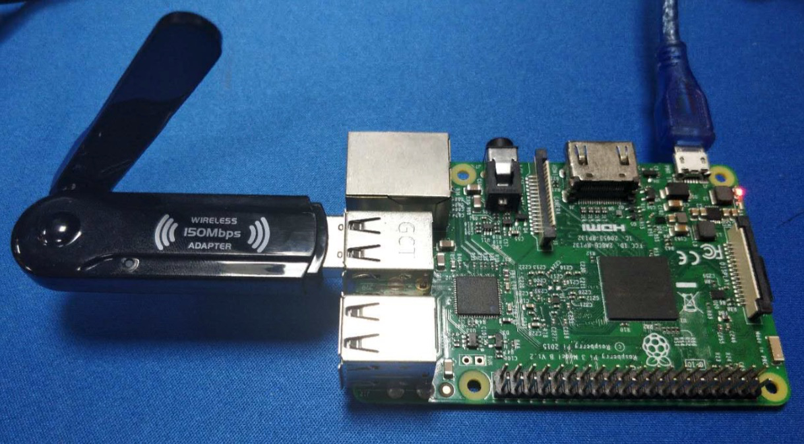
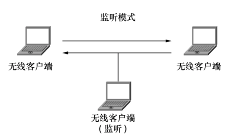

# hmpa-pi

在树莓派上，利用 Wireshark 扫描附近网络 WiFi 设备，并对扫描结果通过邮件或者微信进行推送。

临近春节回老家过年，家里没人，又不想安装摄像头监控，参考 [howmanypeoplearearound](https://github.com/schollz/howmanypeoplearearound) 写了一个监测脚本，当有手机或其它 Wi-Fi 设备在附近时，通过邮件或者微信提醒。

<p align="center">
    
</p>

## 特性

- [x] Wi-Fi 设备扫描
- [x] 邮件提醒
- [x] 微信提醒(Server 酱)
- [ ] 陌生设备检测

## 原理

在 Wi-Fi 网络中，无线网卡是以广播模式发射信号的。当无线网卡将信息广播出去后，所有的设备都可以接收到该信息。将无线网卡设置为监听模式后，就可以捕获到该网卡接收范围的所有数据包。
通过这些数据包，就可以扫描出附近 Wi-Fi 的网络内的设备与信号强度。

<p align="center">
    
</p>

## 监听模式的网卡

一些支持监听模式的网卡

> [wifi-adapter-that-supports-monitor-mode](https://github.com/schollz/howmanypeoplearearound#wifi-adapter-that-supports-monitor-mode)

- [USB Rt3070 $14](https://www.amazon.com/gp/product/B00NAXX40C/ref=as_li_tl?ie=UTF8&tag=scholl-20&camp=1789&creative=9325&linkCode=as2&creativeASIN=B00NAXX40C&linkId=b72d3a481799c15e483ea93c551742f4)
- [Panda PAU5 $14](https://www.amazon.com/gp/product/B00EQT0YK2/ref=as_li_tl?ie=UTF8&tag=scholl-20&camp=1789&creative=9325&linkCode=as2&creativeASIN=B00EQT0YK2&linkId=e5b954672d93f1e9ce9c9981331515c4)
- [Panda PAU6 $15](https://www.amazon.com/gp/product/B00JDVRCI0/ref=as_li_tl?ie=UTF8&tag=scholl-20&camp=1789&creative=9325&linkCode=as2&creativeASIN=B00JDVRCI0&linkId=e73e93e020941cada0e64b92186a2546)
- [Panda PAU9 $36](https://www.amazon.com/gp/product/B01LY35HGO/ref=as_li_tl?ie=UTF8&tag=scholl-20&camp=1789&creative=9325&linkCode=as2&creativeASIN=B01LY35HGO&linkId=e63f3beda9855abd59009d6173234918)
- [Alfa AWUSO36NH $33](https://www.amazon.com/gp/product/B0035APGP6/ref=as_li_tl?ie=UTF8&tag=scholl-20&camp=1789&creative=9325&linkCode=as2&creativeASIN=B0035APGP6&linkId=b4e25ba82357ca6f1a33cb23941befb3)
- [Alfa AWUS036NHA $40](https://www.amazon.com/gp/product/B004Y6MIXS/ref=as_li_tl?ie=UTF8&tag=scholl-20&camp=1789&creative=9325&linkCode=as2&creativeASIN=B004Y6MIXS&linkId=0277ca161967134a7f75dd7b3443bded)
- [Alfa AWUS036NEH $40](https://www.amazon.com/gp/product/B0035OCVO6/ref=as_li_tl?ie=UTF8&tag=scholl-20&camp=1789&creative=9325&linkCode=as2&creativeASIN=B0035OCVO6&linkId=bd45697540120291a2f6e169dcf81b96)
- [Sabrent NT-WGHU $15 (b/g) only](https://www.amazon.com/gp/product/B003EVO9U4/ref=as_li_tl?ie=UTF8&tag=scholl-20&camp=1789&creative=9325&linkCode=as2&creativeASIN=B003EVO9U4&linkId=06d4784d38b6bcef5957f3f6e74af8c8)

## 软件安装

### Mac

```bash
 brew install wireshark
 brew cask install wireshark-chmodbpf
```

### Linux 或 Raspberry Pi

```bash
sudo apt-get install tshark

# run as non-root

sudo dpkg-reconfigure wireshark-common     (select YES)
sudo usermod -a -G wireshark ${USER:-root}
newgrp wireshark
```

## 配置网卡

- 如果是支持监听模式的网卡，可以直接运行

- 如果刚好在使用 `rtl8188 usb Wi-Fi 网卡` + Raspberry Pi ，需要先卸载 `rtl8192` 驱动，再加载 `rtl8188` 驱动

    ```bash
    #!/usr/bin/env bash
    uname -a
    
    # disable rtl8192 driver
    sudo depmod 4.14.79-v7+
    sudo rmmod 8192cu
    sudo modprobe rtl8192cu
    
    # set RTL8188 monitor mode
    sudo ifconfig wlan1 down
    sudo iwconfig wlan1 mode monitor
    sudo ifconfig wlan1 up
    ```

## 运行代码

### 下载代码
```bash
git clone https://github.com/wangshub/hmpa-pi.git 
cd hmpa-pi/ && pip install -r requirements.txt

```

### 编辑配置文件

```bash
cp config/config.py.example config/config.py
vi config/config.py
```

参考配置

```python
adapter = 'wlan1'

use_email = True
email = {"host": "smtp.163.com",
         "port": 465,
         "user": "xxxxxxx@163.com",
         "password": "xxxxxxxxxx",
         "to_user": "xxxxxxxx@xxxx.com"}

use_wechat = True
serverchan = {"sckey": "xxxxxxxxxxxxxxxxxxxxx"}


known_devices = {"94:65:2d:xx:xx:xx": "my cellPhone",
                 "dc:a4:ca:xx:xx:xx": "my Mac",
                 "b8:27:eb:xx:xx:xx": "my raspberry"}
```

### 运行

```bash
python main.py
```

## 消息推送

- [Server 酱微信推送](http://sc.ftqq.com/3.version)，需要 Github 登录获取 `sckey`
- yagmail 邮箱推送

## 运行结果

```text
2019-01-24 07:37:01.211617 一共发现了 67 台设备

Known Devices:
- my cellPhone
- my raspberry
- my mac

All Devices:
- 00:e0:70:3e:xx:xx 14 DH TECHNOLOGY
- 94:65:2d:91:xx:xx 14 OnePlus Technology (Shenzhen) Co., Ltd
- dc:d9:16:7e:xx:xx -12 HUAWEI TECHNOLOGIES CO.,LTD
- b8:27:eb:12:xx:xx -20 Raspberry Pi Foundation
- 98:01:a7:eb:xx:xx -40 Apple, Inc.
- 20:5d:47:44:xx:xx -44 vivo Mobile Communication Co., Ltd.
- ac:b5:7d:5f:xx:xx -46 Liteon Technology Corporation
- 04:03:d6:1f:xx:xx -47 Nintendo Co.,Ltd
- d4:ee:07:55:xx:xx -48 HIWIFI Co., Ltd.
- 44:6e:e5:63:xx:xx -51 HUAWEI TECHNOLOGIES CO.,LTD
- 14:75:90:8d:xx:xx -51 TP-LINK TECHNOLOGIES CO.,LTD.
- 34:96:72:1d:xx:xx -56 TP-LINK TECHNOLOGIES CO.,LTD.
- d8:cb:8a:74:xx:xx -57 Micro-Star INTL CO., LTD.
- 40:8d:5c:21:xx:xx -57 GIGA-BYTE TECHNOLOGY CO.,LTD.
- 6c:59:40:25:xx:xx -58 SHENZHEN MERCURY COMMUNICATION TECHNOLOGIES CO.,LTD.

More ...
```

## TODO

- [ ] 美化打印信息
- [ ] 更优雅的参数配置
- [ ] 当发现新设备时提醒
- [ ] 绘图统计
- [ ] 设备距离估计

## 参考链接

- [schollz / howmanypeoplearearound](https://github.com/schollz/howmanypeoplearearound)
- [derv82 / wifite2](https://github.com/derv82/wifite2)
- [第 3 章 监听 WiFi 网络](http://www.tup.tsinghua.edu.cn/upload/books/yz/067209-01.pdf)

## License

- MIT
- 仅供学习和研究，切勿非法使用
